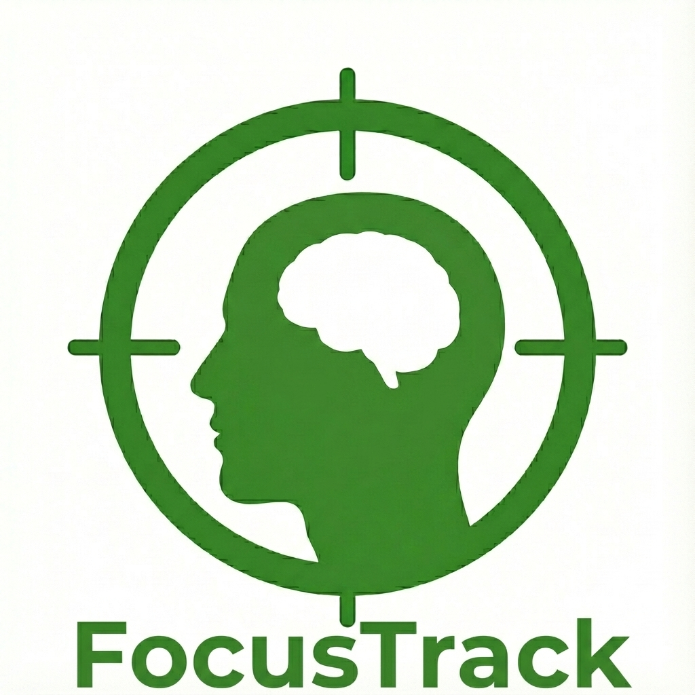

# 🎯 FocusTrack (MVP)

  
  <h1>FocusTrack</h1>
  

    <b>Data-Driven Focus Management Solution for Academies with Computer Vision</b>
  

 

## 🌰 In a nutshell...
> **Data-Driven Focus Management Solution for Academies with Computer Vision**
> 
> 컴퓨터비전 기술을 사용해 학습자의 집중도를 실시간으로 측정 및 분석하여 학습 효율을 극대화하는 솔루션입니다.

 

## 🧐 Problem & Solution

### ❓ The Problem
기존의 관리형 독서실이나 캠스터디 시스템은 단순히 <b>착석 여부(Quantity)</b>만을 관리합니다. 학부모는 학생이 등원했다는 사실만 알 수 있고, 학생은 자신이 정확히 얼마나 몰입했는지 모른 채 '오래 앉아 있었다'는 사실만으로 위안을 얻습니다.

### ❗️ Our Solution
**FocusTrack**은 컴퓨터 비전(Computer Vision) 기술을 활용해 사용자의 실제 학습 행동을 분석하고, **데이터 기반의 피드백**을 제공합니다.

- **Hyper-Personalization (초개인화):** 획일적인 자세 기준이 아닌, 사용자별 고유한 학습 자세를 캘리브레이션하여 판정합니다.
- **Privacy First:** 영상 데이터를 서버로 전송하지 않고, 디바이스 내에서 처리하는 온디바이스 AI(On-device AI)를 지향합니다.
- **Actionable Insight:** 단순 기록을 넘어, 집중도가 깨지는 시간대와 패턴을 분석한 **집중도 분석 리포트**를 제공합니다.

 

## ✨ Key Features (MVP)

* <b>🦾 Multi-Pose Calibration (멀티 포즈 캘리브레이션):</b>
    * 개개인의 다양한 학습 자세에 맞추어 최적화합니다. 정자세, 몰입(앞으로 숙임), 이완(뒤로 기댐) 등 사용자의 <b>3가지 자세 패턴</b>을 모두 학습합니다.
    * 자연스러운 움직임을 허용하는 **강건한(Robust) 알고리즘**으로 오탐지 스트레스를 최소화했습니다.

* <b>⏱️ Real-time Focus Analytics (실시간 집중 분석):</b>
    * 미디어파이프(MediaPipe) 기반으로 33개의 관절 포인트를 초당 30회 분석합니다.
    * <b>마할라노비스 거리(Mahalanobis Distance)</b>를 적용하여, 단순 거리 계산보다 정밀한 이상치 탐지(Anomaly Detection)를 수행합니다.

* <b>📊 Time-series Logging (시계열 데이터 로깅):</b>
    * 집중도 변화를 0.0~1.0 사이의 연속적인 수치로 기록합니다.
    * 순간적인 움직임에 흔들리지 않도록 <b>이동 평균(Moving Average)</b> 필터를 적용하여 데이터의 신뢰성을 확보했습니다.

* <b>🔒 Privacy-First On-Device AI:</b>
    * 민감한 영상 데이터를 서버로 전송하지 않습니다. 모든 연산은 로컬(Edge Device)에서 처리되며, 서버로는 오직 타임스탬프와 '집중 여부(0/1)' 데이터만 전송됩니다.

 

## 🧠 Core Logic (Data Pipeline)

시스템은 크게 **Edge(수집/판정)** → **Server(가공/저장)** → <b>Client(시각화)</b>의 3단계로 작동합니다.

1.  **Input (Edge):** 웹캠을 통해 라즈베리파이(또는 PC)로 실시간 영상 스트림 입력.
2.  **Feature Extraction (MediaPipe):** 배경을 소거하고, 사용자의 관절 좌표(Landmark 33개)만을 추출.
3.  **Anomaly Detection (One-Class):** * Calibration: 시작 시 사용자의 3가지 자세(정자세, 몰입, 이완) 데이터를 수집하고 병합(Aggregation)하여, 개인별 고유한 다변량 분포(Multivariate Distribution)를 생성.
    * **Distance Calculation:** 실시간 좌표가 기준점 임계값(Threshold)을 벗어나면 즉시 <b>'비집중(Outlier)'</b>으로 판정. (별도의 '딴짓' 데이터 학습 불필요)
4.  **Data Transmission:** 엣지 디바이스는 영상이 아닌, 판정된 결과값(`0` or `1`)과 타임스탬프만을 JSON 형태로 서버에 전송.
5.  **Data Aggregation (Server):** 서버는 수신된 시계열 데이터를 분석하여 **순수 집중 시간(Net Focus Time)**, **집중 유지 구간**, **이탈 빈도** 등을 가공.
6.  **Visualization (User):** 사용자는 웹 대시보드를 통해 시각화된 <b>'일간/주간 집중 리포트'</b>를 확인하고 학습 패턴을 점검.

 

## 🛠 Project Status
 

현재 **MVP 개발 단계**입니다.

 

## ⚙️ Tech Stack

| Category | Technology |
| --- | --- |
| **Language** | Python 3.11+ |
| **Vision AI** | MediaPipe Pose, OpenCV |
| **Algorithm** | NumPy (Vector Ops), Anomaly Detection |
| **Edge Device** | Raspberry Pi 4 / 5 (Target) |
| **Backend** | FastAPI (Planned) |
| **Frontend** | Streamlit (MVP) |

 

## 📚 Engineering Wiki & Dev Log
프로젝트 진행 과정에서 고민한 기술적 의사결정과 문제 해결 과정을 기록했습니다.

### 🏗️ Architecture Decision Records (ADR)
주요 기술 스택 선정 및 아키텍처 변경에 대한 의사결정 내역입니다.
* [📂 ADR-001: 전체 이미지 분석(MobileNet)에서 좌표 기반 분석(MediaPipe)으로의 전환](docs/ADR/001_switch_to_mediapipe.md)
* [📂 ADR-002: 지도 학습(Binary Classification)에서 이상 탐지(Anomaly Detection)로의 전환](docs/ADR/002_shift_to_anomaly_detection.md)

### 📐 Core Concepts & Algorithms
프로젝트에 적용된 핵심 알고리즘과 수학적 배경지식입니다.
* [📝 Tech Note: 왜 유클리드 대신 '마할라노비스 거리'인가?](docs/concepts/mahalanobis_distance.md)
    * *좌표의 분산과 공분산을 고려한 통계적 거리의 도입 배경 및 원리*
* [📝 Tech Note: 유한 상태 머신 (Finite State Machine)](docs/concepts/pattern_state_machine.md)

### 🛠️ Troubleshooting
* [🐛 Fix: "거리 22억" 버그 - 특이 행렬(Singular Matrix)과 Regularization](docs/troubleshooting/ts_001_singular_matrix_fix.md)
* [🐛 Fix: Numpy 차원 불일치 문제와 .flatten() 활용](docs/troubleshooting/ts_002_numpy_flatten.md)

 

## 🚀 Roadmap & Progress

- [x] **Ideation & Market Research**: 문제 정의 및 기존 솔루션 분석.
- [x] **Prototyping (Phase 1)**: MobileNet 기반 이미지 분류 모델 테스트 (-> *Background Noise 문제로 폐기*) (2025.12.19 ~ 2025.12.24)
- [ ] **MVP Development (Phase 2)**: MediaPipe + 이상 탐지(Calibration) 알고리즘 구현 및 로컬 시각화(Streamlit). **(~2026.02.09)**
- [ ] **Backend & Data Pipeline (Phase 3)**: FastAPI 서버 구축, 시계열 데이터 DB 설계, 집중도 분석 로직(순수 공부 시간 산출) 구현.
- [ ] **Hardware Porting (Phase 4)**: Raspberry Pi 포팅, 엣지-서버 통신 최적화 및 QR 로그인 시스템 구축.
- [ ] **B2B Deployment**: 관리형 독서실 환경 필드 테스트 및 피드백 반영.

 

## 🚧 한계점 및 향후 계획 (Limitations & Roadmap)

### 1. 현재 모델의 한계: 간접 지표(Proxy Metric)로서의 자세

* <b>한계점:</b>
    * <b>자세 유지 중 딴짓:</b> 바른 자세로 앉아서 스마트폰을 하거나 멍하니 있는 경우(Daydreaming)를 감지하기 어려움.
    * <b>편한 자세로 몰입:</b> 턱을 괴거나 다리를 꼬고 고도로 집중하는 경우를 '비집중'으로 오탐지할 가능성. (멀티 포즈 캘리브레이션으로 일부 완화했으나 여전히 존재)

즉, 현재 단계는 <b>"Focus Tracker"</b>를 지향하는 <b>"Advanced Posture Tracker"</b>에 가깝습니다.

### 2. 기술 고도화 로드맵 (Future Roadmap)
단순 자세 분석을 넘어, <b>Multi-modal Focus Sensing</b>을 통해 진정한 의미의 집중도 측정기로 발전시킬 계획입니다.

* <b>Phase 1: Gaze & Blink Analysis (졸음/멍때림 탐지)</b>
    * 눈의 랜드마크(Eye Aspect Ratio, EAR)를 분석하여 눈 깜빡임 빈도 측정.
    * 다른 곳을 장시간 응시하는 시선 이탈(Gaze Tracking) 감지.
* <b>Phase 2: Object Detection (딴짓 탐지)</b>
    * YOLO 등 경량 객체 탐지 모델을 조건부(Trigger-based)로 가동.
    * 학습 공간 내 <b>스마트폰, 책 이외의 잡지, 게임기</b> 등이 검출될 경우 즉각적인 감점 처리.
* <b>Phase 3: Screen Activity Monitoring (선택 사항)</b>
    * (옵션) 사용자의 동의하에 활성 윈도우(Active Window) 타이틀을 분석하여, IDE/문서 뷰어가 아닌 유튜브/SNS 사용 시 집중도 점수 보정.

### 3. 🌐 Long-term Vision
* <b>Hardware:</b> 보급형 AI 키트(RPi + Cam)를 B2B(학원/독서실)에 공급하여 오프라인 접점 확보.
* <b>Data Loop:</b> 수집된 익명 행동 데이터(Behavioral Data)를 기반으로 집중 패턴 정밀 분석 모델 고도화.
* <b>Flywheel:</b> [데이터 축적] -> [알고리즘 고도화] -> [개인화 솔루션 제공] -> [시장 점유율 확대]의 선순환 구조 구축.

### 4. 📱 FocusTrack Ecosystem (Post-MVP)
하드웨어 키트와 연동되는 **Companion Mobile App**을 개발하여 물리적/디지털 환경을 동시에 통제합니다.

* <b>Real-time Sync & Hard-Lock:</b>
    * FocusTrack 키트가 '집중 시작'을 감지하면, BLE/MQTT를 통해 모바일 앱으로 신호 전송.
    * <b>Android:</b> Accessibility Service를 활용하여 실행 즉시 강제 종료.
    * <b>iOS:</b> <b>Screen Time API (FamilyControls)</b>를 활용하여, OS 레벨에서 방해 앱(SNS, 게임 등) 실행을 원천 차단(Shielding).
* <b>Silent Alarm:</b>
    * 졸음 감지 시, 독서실 같은 조용한 환경을 고려하여 스피커 경고음 대신 <b>스마트폰/스마트워치 진동</b>으로 깨워줌.

---
Contact: jin.yoon.builds@gmail.com